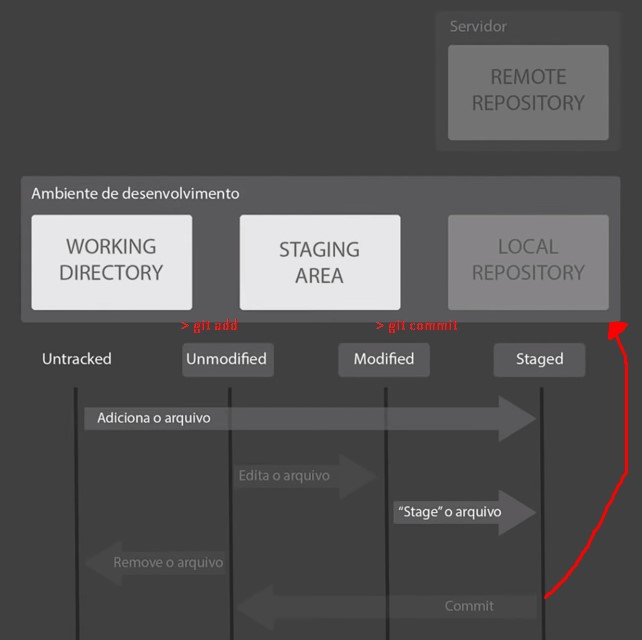

### Git Fundamentals

#### File status life-cycle


#### Basic Commands

```shell
#initialize an empty repository
git init
```

```shell
#define a git author
git config --global user.email <user@xpto.com>
git config --global user.name <username>
```

```shell
#move all modified/untraked files to staging area
git add *
```

```shell
#take a snapshot for the current repository (local repository)
git commit -m "my first commit"
```

````shell
#configure a remote repository to send your code. (in this example, a GitBuh repository)
git remote add origin https://github.com/rsalesf/git-fundamentals.git
````

````shell
#send your code/branch to remote repository
git push origin master
````

Tips:

​	```git log``` [command](https://git-scm.com/book/en/v2/Git-Basics-Viewing-the-Commit-History) show all the commits made to a repository.

​	```git status``` command to see the status of working directory and stating area.
